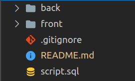

# fullstack

### API para listar Pokemons

```
{
"pokemons": [
  {
    "id": 1,
    "name": "Charmander",
    "type": "Fire"
  },
  {
    "id": 2,
    "name": "Charmeleon",
    "type": "Fire"
  },
  {
    "id": 3,
    "name": "Squirtle",
    "type": "Water"
  },
...
}
```

### Estrutura de pastas


### Como executar

Entre na **pasta do back** e instale as dependências
```
npm install
```

Entre na **pasta do front** e instale as dependências
```
npm install
```

Suba seu **servidor de back** (ele roda na porta **3000**)
```
npm start
```

Execute o **script.sql** no seu *terminal* ou *workbench*
